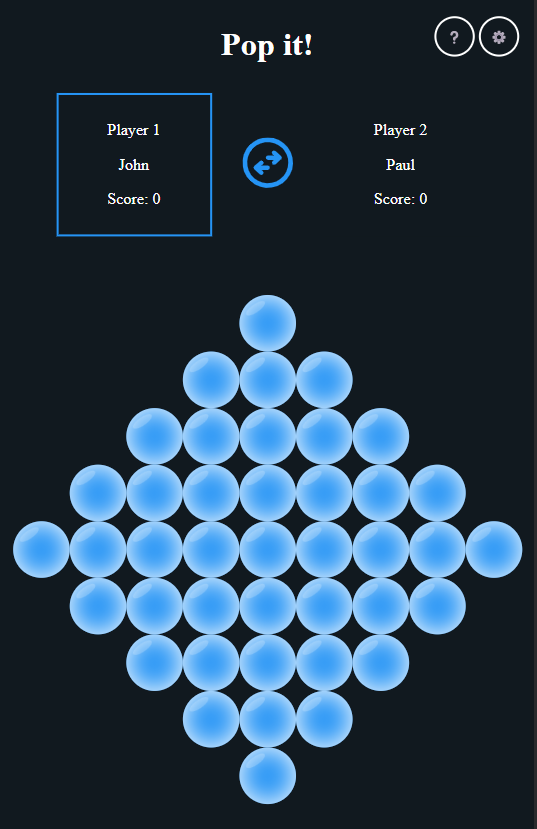

# Pop-it game

"Pop it!" is a 2 players game where the goal is to not be the one that pop the last bubble.

Each turn you could pop between 1 and 3 bubbles situated <em>on the same line</em> before passing the hand to the other player with the  button.

You could choose the shape of the board in the settings.

You could decide also in the settings to play againt someone else or the computer with 2 levels of difficulties.

[You can play it here](https://pmiossec.github.io/ih_module1_project_game/)

PS: If you like to pop bubbles a lot and try to pop the top title a lot of times, maybe you will get an easter egg...
# Screenshot

<!-- ## TODO / Planning

* [ ] Reset
* [ ] Shapes from background image
* [ ] fidget mode

https://pixabay.com/sound-effects/search/bubble/ -->